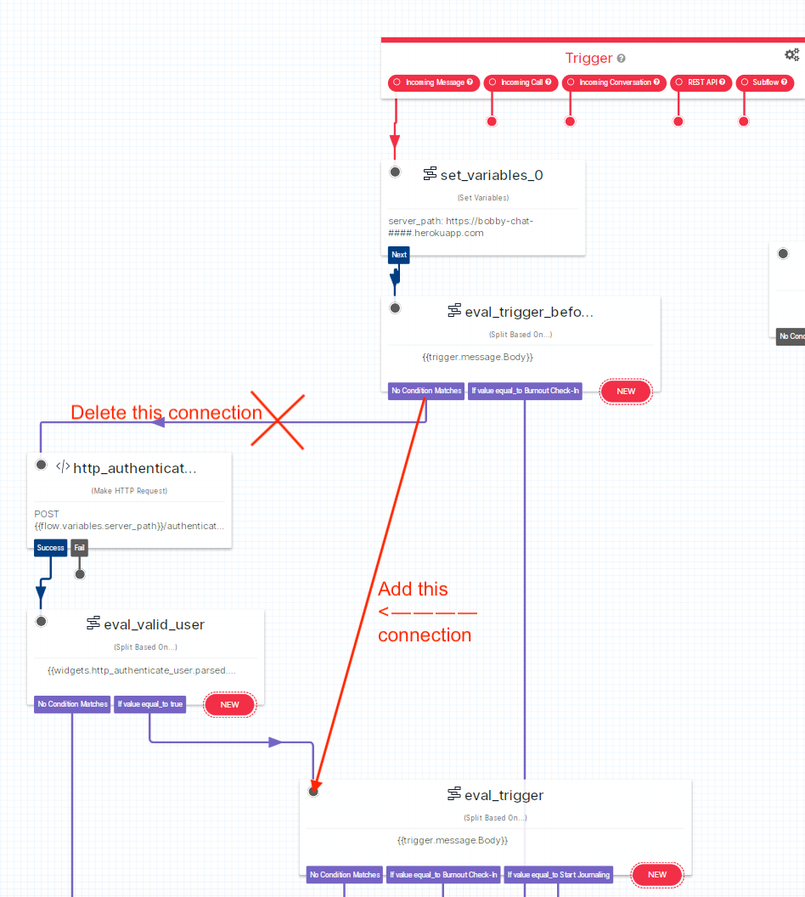

# Build your own well-being companion in WhatsApp

## BobbyChat

In 2023 we (my co-founder and I) saw the growing need for *someone* to build *something* to solve the mental health crisis. To this end we started BobbyChat, with a clear mission to make mental well-being accessible to everyone.
A year on, and while we were able to help thousands of individuals with workplace stress, we have made the difficult decision to retire BobbyChat.


However, we still get messages almost every week from individuals asking how they can access Bobby and so we've decided to share our MVP and some learnings (see the READMEs) in the hopes that it inspires others to build mental well-being solutions in a responsible manner.


# Table of contents
1. [Overview](#overview)
    1. [What you will need](#need)
    2. [Setup](#setup)
    	1. [Importing the Twilio Flows into Twilio Studio.](#import)
    	2. [Launch the app using Ngrok](#ngrok)
    	3. [Setup your PostgreSQL database](#postgresql)
    	4. [Setup Google Cloud Storage (optional)](#gcs)
    	5. [Setup your .env file.](#env)
    	6. [Initiate a conversation](#start)
    	7. [Trouble Shooting](#TS)
2. [Further Reading](#reading)
	1. [What is a medical device?](#md)
	2. [How can I make my app GDPR compliant?](#gdpr)
	3. [Why did you use WhatsApp?](#whatsapp)
	4. [How did you make conversations purposeful?](#purpose)


### <a name="overview"></a>Overview

BobbyChat communicates with users via WhatsApp. To send and receive messages via WhatsApp, we use [Twilio Studio](https://www.twilio.com/docs/studio/user-guide). Twilio Studio allows us to design the structure of a conversation (see example image below) while executing each step of the conversation using language models (aka GenAI).

.

Twilio communicates with our language models via an API which needs to be hosted publicly (so that Twilio can access the end-points). We used [Heroku](https://www.heroku.com/) (with a PostgreSQL database), and Ngrok for testing and developing locally.

Our API also communicated with Stripe, Google Cloud Storage and EmailOctopus. Integrations with Stripe and EmailOctopus allowed us to put up a paywall (despite serving our app through WhatsApp), authenticate users and integrate other marketing channels. These elements can be easily removed/ skipped. 
We decided to open source the code with these elements to serve as a _starting point_ for others looking to build paid-for-products in WhatsApp. See a high-level overview of the architecture below.


### <a name="need"></a>What you will need

* Twilio (required)
	* A Twilio account.
	* In Twilio [configure a WhatsApp sender](https://console.twilio.com/us1/develop/sms/senders/whatsapp-senders).
	* Then you should have a:
		* [TWILIO_AUTH_TOKEN](https://console.twilio.com/)
		* [TWILIO_ACCOUNT_SID](https://console.twilio.com/)
		* WHATSAPP_NUMBER
	* Add these to a .env file ([what is a .env file?](https://medium.com/@sujathamudadla1213/what-is-the-use-of-env-8d6b3eb94843)).

* [Heroku](https://www.heroku.com/) or [Ngrok](https://ngrok.com/docs/getting-started/) account (or equivalent, required) for hosting your API on the internet so that Twilio can communicate with it.
	* The path at which your website is hosted is `YOUR_SERVER_PATH` (we will use this later).

* A PostgreSQL database (required).
	* This can either be [setup as an add-on](https://devcenter.heroku.com/articles/heroku-postgresql) in Heroku or setup [locally](https://www.postgresql.org/).
	* Then you should have a `DATABASE_URL` something similar to `postgresql:///<db_name>`. Add this to your .env file.

* ChatGPT (required).
	* An [OpenAI account](https://platform.openai.com/signup) with a `OPENAI_API_KEY` which you can find [here](https://platform.openai.com/api-keys).
	* Add `OPENAI_API_KEY` to your .env file.

* Stripe (optional and not recommended).
	* To access BobbyChat our users had to purchase a subscription via Stripe. When a purchase was complete Stripe would send a webhook to our app (https://docs.stripe.com/webhooks/quickstart) with the user's phone number and this allowed us to seamlessly authenticate paying users via their phone number. Stripe also sent webhooks when the subscription expired.
	* Add `STRIPE_API_KEY` and `STRIPE_SECRET` to your .env file.

* Google Cloud Storage (optional and not recommended).

**Important** Everything in your .env file is a secret, don't share it with anyone else (and don't accidentally commit it -- it could be an expensive mistake).


### <a name="setup"></a>Setup

Since Bobby interacts with many other external API's and micro-services (e.g. Stripe, EmailOctopus etc) this code will **not** run out of the box and will require some setup.

#### <a name="import"></a>1. Importing the Twilio Flows into Twilio Studio.

Once you have forked this repo, you will have a folder named `twilio_flows`. This folder holds the Twilio Flow JSONs that execute the conversation. You will need to navigate to your [Twilio Console](https://console.twilio.com/) > Studio > Flows > Create new Flow > _name the flow the same as the file name_ > Import from JSON.

You can either experiment with one flow at a time (recommended) or import them all with the main flow being MVP0-v0.15.

You will need to [connect the flow to a Twilio WhatsApp sender (phone number)](https://www.twilio.com/docs/studio/tutorials/customer-support-menu#connect-your-whatsapp-sender-to-your-studio-flow). **Be sure to connect it to a WhatsApp number (not a regular number)**.

It's recommended to start with one feature, for example, Sphere-of-Influence-Flow-v0.1 (since the flow is more simple).

#### <a name="ngrok"></a>2. Launch the app using Ngrok (for testing and personal use only).

You can launch the app using [Ngrok](https://ngrok.com/docs/getting-started/) or Heroku or any other service. Ngrok is perfect for testing and personal use.

Launch the app (from inside the **twilio** folder):
`$ python3 app.py`

Launch the app on the internet:
`ngrok http 8000`

#### <a name="postgresql"></a>3. Setup your PostgreSQL database (locally).

Once you had installed PostgreSQL run the following command to login to your PostgreSQL server using your username and hostname (if you have them).

`$ psql -U <username> -h <hostname>`

Create a database:

`$ CREATE DATABASE <database_name>;`


Your `DATABASE_URL` will have the form `postgresql://<username>:<password>@<hostname>:<port>/<database_name>`. You can find out this info using the `\conninfo` command.


#### <a name="gcs"></a>4. Setup Google Cloud Storage (optional).

TODO(tonicreswell) Write this section.


#### <a name="env"></a>5. Setup your .env file.

Create a .env file (inside the **twilio** folder):

`$ vim .env`

Open the file and paste the following, replacing the #### values with your own (the Google credentials are optional and only required for the Burnout Survey flow). For local testing STRIPE_SECRET should be set to None.

```
OPENAI_API_KEY=####
DATABASE_URL=postgresql:///####
TWILIO_AUTH_TOKEN=####
TWILIO_ACCOUNT_SID=####
WHATSAPP_NUMBER=+####

GOOGLE_API_KEY=####
GOOGLE_CREDENTIALS=####.json
GOOGLE_APPLICATION_CREDENTIALS=####.json

STRIPE_API_KEY=sk_test_####
STRIPE_SECRET=####
```

#### <a name="start"></a>6. Initiate a conversation.

Make sure that you have connected one of your WhatsApp senders to one of the flows (we recommend the Sphere-of-Influence flow to get started) and send a "Hi" message via WhatsApp to that connected number. This will initiate the conversation and the magic will begin.

#### <a name="TS"></a>7. Trouble Shooting

a. What is a WhatsApp sender?

For a quick-start you can use [Twilio's WhatsApp sandbox](https://console.twilio.com/us1/develop/sms/try-it-out/whatsapp-learn) which allows you to connect to send WhatsApp messages to a small number of users. Go to the Sandbox settings to change where incoming messages are sent.

If you have set a Twilio account, you will find your WhatsApp senders [here](https://console.twilio.com/us1/develop/sms/senders/whatsapp-senders).

b. I have a WhatsApp sender why is nothing happening when I send a message?

You need to make sure that your WhatsApp sender is connected to the correct flow. Follow [these steps to setup the end point URLs](https://console.twilio.com/us1/develop/sms/try-it-out/whatsapp-learn); it's as simple as copying a URL from one place to another.

c. I'm getting a `KeyError: 'TWILIO_ACCOUNT_SID'` when I run `$ python3 app.py`.

This means that your .env file is not configured correctly. Make sure the file is named .env and that the missing key is in the .env file.

d. I'm getting an error on the `Make HTTP Request` widgets, what is `flow.variables.server_path`?

Each flow will have a `server_path` or `ngrok_path` (or similar variable) set in the first widget of each flow. You must replace this with your Ngrok (or equivalent) path.

e. How do I find my Ngrok path?

When you run `$ ngrok http 8000` you will see something similar to `https://####-##-##-##-###.ngrok-free.app -> http://localhost:8000 `. `https://####-##-##-##-###.ngrok-free.app` is your Ngrok path.


f. I'm getting an error on the `Make HTTP Request` widgets and I've set my server path correctly?

Visit `https://####-##-##-##-###.ngrok-free.app` and you may see an error message. Ngrok also have brilliant inspectors which show you exactly where things are going wrong in the HTTP calls.

g. When I start a conversation I'm being told it's not possible to buy a subscription. How do I bypass this?

**Bypass Stripe Authentication (required)** You can bypass the user authentication in the MVP0-v0.15 Flow in Twilio Studio by directly connecting `eval_trigger_before_authentication [No Condition Matches]` to `eval_trigger` (see the image below).



h. Some images are missing, where are they?

TODO(tonicreswell) Add images to repo.

## <a name="reading"></a>Further Reading

Below are a collection of some of our learnings and some helpful resources if you are interested in building in the mental health/ wellbeing space.

### <a name="md"></a>What is a medical device?

If you are serious about building mental health apps, check out this [document](https://assets.publishing.service.gov.uk/media/64a7d22d7a4c230013bba33c/Medical_device_stand-alone_software_including_apps__including_IVDMDs_.pdf) to get an understanding of what it means to build a medical device. It comes down to the "intended purpose" (see the figure below taken from the document above). If your app intends to treat, prevent, diagnose or monitor it could be a medical device and will need to be regulated (depending on your country).


### <a name="whatsapp"></a>Why did you use WhatsApp?

If you are anything like me, you probably already have 100 apps on your phone, some of which you NEVER open. One app I, and 2 billion other people, use regularly is WhatsApp. It's a familiar user interface with no download required. It's also easy to send people notifications of new features and reminders. You can even give people a link to connect directly to your bot, `https://wa.me/<number>`. Yes, it's really THAT SIMPLE!

Building in WhatsApp allowed us to iterate faster; there was no front-end to "tweak", forcing us to focus our efforts on improving the conversational interaction that the user was having. It also meant that every interaction our users had with Bobby, had to be a conversation, which made the interaction more authentic.

### <a name="purpose"></a>How did you make conversations purposeful?

As you can probably tell, Bobby is not just a single LLM, it's actually quite complex. Rather than users having purely open-ended conversations, we wanted to guide users through tried-and-tested techniques used in therapy/ coaching. To this end we took a hybrid approach to design, mixing _hard coded conversation design_ (e.g. Siri) with open ended LLMs. This allowed for purposeful, structured conversations with an open-ended feel.
There was still a lot of work to do here, but this is a significant starting point.
